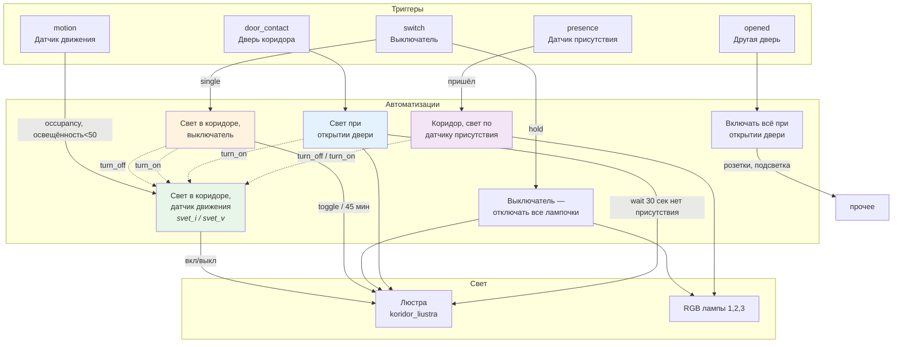

# Анализ automations.yaml — что улучшить и оптимизировать

**Источник для анализа:** только актуальный `automations.yaml` из HA (MCP `ha_read_file("automations.yaml")`). Не опираться на локальные копии, патчи или отдельные JSON — там может быть мусор и не то.

**Обязательно сверять с HA:** по каждой авто смотреть в HA, **включена она или отключена**. В YAML лежит всё подряд; половина может быть выключена — по отключённым авто рекомендации не давать (или явно помечать «отключена, не трогать»).

Ниже — находки и рекомендации (отключённые помечены).

---

## 1. Авто только в реестре (не в automations.yaml)

**Проблема:** В реестре HA есть авто с id вроде `new_automation`, `krutilka_u_egora`, `sinkhronizatsiia_*`, `kostyl_fiks_*` — без триггеров/действий, в самом `automations.yaml` их нет. Они засоряют список в UI.

**Рекомендация:** Удалить их через Настройки → Автоматизации (три точки у авто → Удалить), если не нужны. Либо оставить как есть — на работу авто из YAML это не влияет.

---

## 2. «Режим кормушки» — триггер не срабатывает

**Проблема:** У автоматизации «Режим кормушки» (id `1759855659355`) триггер по `input_boolean.rezhim_kormushki` имеет **`enabled: false`**. Из-за этого при переключении переключателя авто не запускается.

**Рекомендация:** В редакторе авто включить триггер (снять галочку «Отключено» у триггера) или пересоздать триггер «Состояние» по `input_boolean.rezhim_kormushki` без отключения.

---

## 3. ~~«Свет в коридоре, датчик движения»~~ — снято

Отключён только шаг **delay** (1 мин 1 сек); **wait_for_trigger** (нет движения 1 мин) и **turn_off** выполняются, свет выключается через минуту. Менять ничего не нужно.

---

## 4. Условие «до рассвета» отключено в авто по будильнику

**Проблема:** В автоматизации **«Свет В МОМЕНТ будильника (ФИНАЛ)»** условие **Sun — до восхода** стоит с **`enabled: false`**. Проверка «включать свет только когда ещё темно» не выполняется, свет может включаться и когда уже рассвело.

Вторая авто из того же контекста — **«Свет у Егора, включать утром в будние дни v. 2»** — **целиком отключена** (сама автоматизация выключена в HA). В ней ничего менять не нужно.

**Рекомендация:** Включить условие «до восхода» только в авто «Свет В МОМЕНТ будильника (ФИНАЛ)» (снять «Отключено» у условия в редакторе).

---

## 5. Гирлянда — кто включает/выключает

**Сейчас гирляндой управляют несколько авто:**

| Авто | Действие | Когда |
|------|----------|--------|
| «Включать гирлянду» | вкл + уведомление | закат, если кто-то дома |
| «Выключать гирлянду» | выкл + уведомление | рассвет (и триггер «0 людей 2 мин» отключён) |
| **«Выключать свет в кухне, когда все ушли»** | **выкл** (без уведомления) | zone.home &lt; 1 в течение 2 мин |
| «Кухня, выключать свет вечером» | выкл (шаг **отключён**) | 22:30 — не срабатывает |
| «Управление подсветкой в кухне через телегу» | toggle | команда /garland |

То есть гирлянда **вырубается** и в «Выключать гирлянду» (по рассвету), и в «Выключать свет в кухне, когда все ушли» (никого дома 2 мин). Объединять только две «гирляндные» авто в одну — полкартины не даёт: логика «все ушли → выкл» живёт в другой авто.

**Рекомендация:** Либо оставить как есть и в п.5 просто держать в голове полный список (таблица выше). Либо сознательно собрать всё управление гирляндой в одну авто: закат → вкл; рассвет → выкл; «никого дома 2 мин» → выкл; и тогда в «Выключать свет в кухне, когда все ушли» **убрать** выключение гирлянды (оставить только подсветку dc15fa2e...), чтобы не было двух мест на одно и то же.

---

## 6. Крутилка у Егора

**Сейчас:** В `automations.yaml` только две рабочие авто: «Крутилка у Егора +» и «Крутилка у Егора -» (rotate_left → уменьшение яркости, rotate_right → увеличение). Пустые `krutilka_u_egora`, `krutilka_u_egora_2` в YAML **нет** — они только в реестре HA (как в п.1).

**Рекомендация:** Пустые из реестра удалить через UI при желании. Рабочие две авто можно при желании объединить в одну с `choose` по `trigger.subtype`, но не обязательно — текущий вариант читаемый.

---

## 7. Свет у Егора — много пересекающихся авто

**Сейчас:** Несколько авто так или иначе управляют светом/сценой у Егора:
- по закату (автовключение),
- по приходу домой (вечером),
- по времени 23:30 / 00:30 / 01:30 (автоотключение света + розетка + ТВ),
- «Свет В МОМЕНТ будильника (ФИНАЛ)» — time_pattern каждую минуту + проверка «сейчас в пределах 2 минут после будильника».

(Авто «Свет у Егора, включать утром в будние дни v. 2» — по времени будильника RMX3840 — в YAML есть, но **целиком отключена**, по сути не используется.)

**Рекомендация:**  
- Оставить как есть по смыслу, но:  
  - задать короткие **description** у каждой («вкл по закату», «выкл в 23:30», «вкл в момент будильника» и т.д.), чтобы не путаться;  
  - «Будильник - точный запуск» — авто **целиком отключена**, трогать не нужно.  
- При желании «Свет В МОМЕНТ будильника» можно перевести с `time_pattern: minutes: "/1"` на один срабатывание по времени из атрибута будильника (trigger time at `state_attr(...)`), чтобы не проверять каждую минуту, но это уже тонкая настройка.

---

## 8. Термпопот

**Сейчас:** Четыре времени (22:30 будни, 04:50 будни, 07:00 выходные, 23:00 выходные) + условие «кто-то дома» + choose по trigger id. Всё ок.

**Рекомендация:** При желании можно сократить дублирование: один блок «включить» с разными текстами уведомления в зависимости от weekday (шаблон в сообщении), один блок «выключить» — аналогично. Не обязательно, текущая схема понятна.

---

## 9. Коридор — несколько авто, связанных через turn_on/turn_off других авто

**Сейчас:**  
- Датчик движения, выключатель (один/удержание), свет по присутствию, свет при открытии двери, «включать всё при открытии двери».  
- Часть логики через включение/выключение других автоматизаций (`svet_i_datchik_dvizheniia`, `svet_v_koridore_datchik_dvizheniia`).

**Схема:**

**Легенда:**  
- **→** прямое действие (свет, и т.п.)  
- **-.->** включение/выключение другой авто  

**Рекомендация:** Логика рабочая, но хрупкая при переименовании. В **description** у каждой авто кратко указать: «выключает X при нажатии выключателя», «включает датчик движения после ухода присутствия» и т.д. Так проще не сломать связку при правках.

---

## 10. Имена и идентификаторы

**Проблема:** Часть автоматизаций с числовыми `id` (17407…) и нормальным `alias`; часть с «человекочитаемым» id (`perekliuchat_svet_u_egora`) и пустым `alias`. В списке HA неочевидно, что за что отвечает.

**Рекомендация:** У всех авто заполнить **alias** (название в UI). Если авто создавались через UI и дублируют старые с числовым id — решить, какие оставить, и у лишних отключить или удалить. Тогда в списке будет меньше дублей и пустых названий.

---

## Краткий чек-лист

| Что сделать | Действие |
|-------------|----------|
| Пустые авто (new_automation*, krutilka_u_egora, sinkhronizatsiia*, kostyl_*) | Удалить или отключить и подписать |
| Режим кормушки | Включить триггер по `input_boolean.rezhim_kormushki` |
| Свет в коридоре, датчик движения | Включить шаг delay + wait + turn_off |
| Условие «до рассвета» в «Свет В МОМЕНТ будильника (ФИНАЛ)» | Включить в редакторе (вторая авто по будильнику отключена целиком) |
| Гирлянда | Учёт: вырубается ещё в «Выключать свет в кухне, когда все ушли»; при объединении — убрать дубль там |
| Свет у Егора | Добавить description, убрать/отключить отладочную «Будильник - точный запуск» при ненадобности |
| Коридор | Добавить короткие description у связанных авто |
| Везде | Заполнить alias у авто с пустым названием |

Если скажешь, с какого пункта начать (например, «удали пустые» или «почини кормушку»), можно расписать пошагово именно под твой интерфейс HA.
